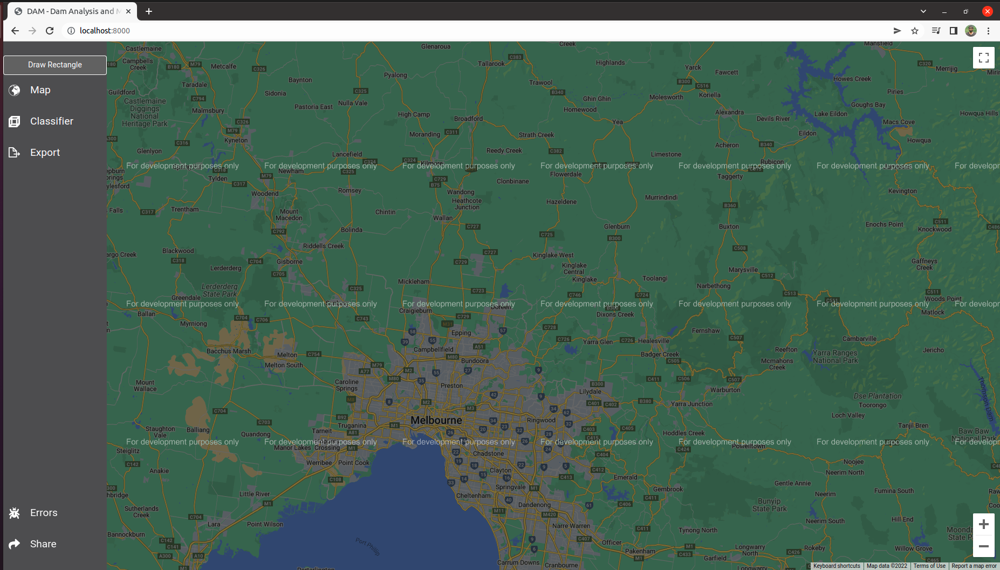

  
Welcome to DAM Project's documentation!   
=======================================

**DAM Project** at the Deakin University is an intiative by a group of highly enthused environmental sciences academics, students and engineers. 
`dam-app-django` is the web application currently hosted at the `thisurldoesnotexistyetbutyeah.com <http://localhost:800>`_. It's an interactive application that allows users to check the water location on the google map.

Check out the :doc:`users` section for further information, including
how to :ref:`developer` information of  the project.

.. note::

   This project is under active development.

Contents
--------

.. toctree::

   users
   developer
   