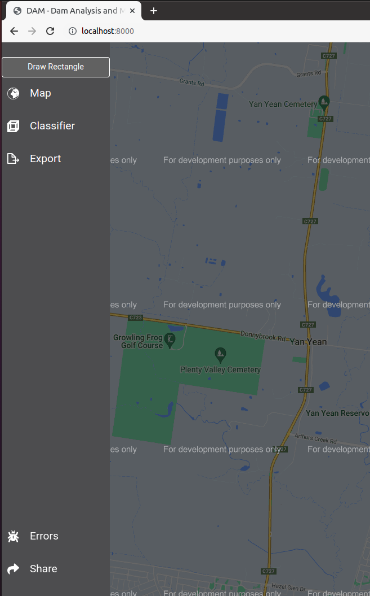

User Instructions   
=================

Step 1: Go to `thisurldoesnotexistyetbutyeah.com <http://localhost:800>`_

.. image:: ../images/2022-04-26_16-13.png
  :width: 400
  :alt: Alternative text

Step 2: Click on the `Draw Rectangle` as shown in the figure below

Step 3: Use the cursor to draw a rectangle

.. image:: ../images/2022-04-26_16-13.png
  :width: 400
  :alt: Alternative text

Step 4: That's it! The results - 

.. image:: ../images/2022-04-26_16-13.png
  :width: 400
  :alt: Alternative text